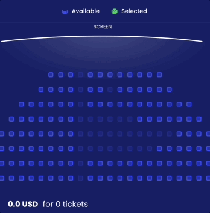
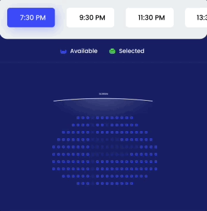

<br><br>
# CinemaSeats


CinemaSeats is a Swift component that represents choosing a seat and booking a ticket in several cinema hall variants. 

- [Requirements](#requirements)
- [Installation](#installation)
- [License](#license)

With CinemaSeats, the user can pick several seats with a tap, select a certain period and book the tickets. The animation clearly represents occupied, available, and chosen seats for each hall. Below one can see a price for selected tickets.  

Here are the animations showing seats and time selections:





## Requirements

- iOS 11.0+
- Xcode 11.0+
- Swift 5.0+

## Installation

### CocoaPods

To integrate CinemaSeats into your Xcode project with CocoaPods, specify it in your `Podfile`:

```ruby
pod 'CinemaSeats', :git => 'https://github.com/shakurocom/CinemaSeatsDemo.git', :commit => de939b1f1de3fa5a9d3981a750978aad9583ef20
```

Then, run the following command:

```bash
$ pod install
```

### Manually

If you prefer not to use CocoaPods, you can integrate Shakuro.CinemaSeats simply by copying it to your project.

## License

Shakuro.CinemaSeats is released under the MIT license. [See LICENSE](https://github.com/shakurocom/ScrollableTabs/blob/master/LICENSE.md) for details.

## Give it a try and reach us

Star this tool if you like it, it will help us grow and add new useful things. 
Feel free to reach out and hire our team to develop a mobile or web project for you.


